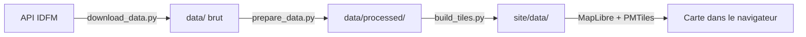
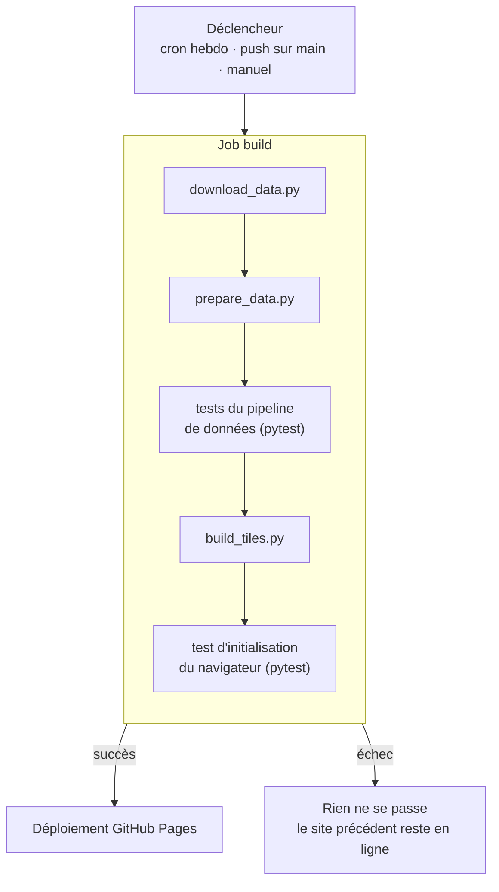

# Le pipeline de données

Ce document décrit le trajet des données, depuis l'API d'Île-de-France Mobilités jusqu'à la carte affichée dans le navigateur, et la façon dont ce trajet est automatisé chaque semaine.

## De la donnée brute au site

- **`data/`** — fichiers bruts tels que fournis par l'API (GeoJSON des lignes, CSV d'accessibilité, etc.).
- **`data/processed/`** — `lines.geojson` et `stops.geojson`, nettoyés et joints (accessibilité par arrêt et par ligne, couleurs et modes normalisés).
- **`site/data/`** — `transports.pmtiles` (les géométries, découpées en tuiles vectorielles par niveau de zoom) et `lines.json` (la liste des lignes utilisée par le panneau de filtres).
- Le navigateur ne télécharge jamais l'intégralité de ces fichiers : il ne demande, via `pmtiles.js`, que les tuiles correspondant à la zone et au niveau de zoom affichés.

Ces trois scripts (`download_data.py`, `prepare_data.py`, `build_tiles.py`) peuvent être relancés à la main pour retrouver l'état exact que produit l'automatisation ci-dessous.

## Automatisation hebdomadaire

Le fichier `.github/workflows/build-deploy.yml` exécute cette chaîne chaque lundi à 3h UTC, à chaque `push` sur `main`, et sur déclenchement manuel. Chaque exécution part d'une machine vierge : aucune donnée ne persiste d'une exécution à l'autre, et le site en ligne n'est modifié qu'à la toute dernière étape — jamais avant que tout ait réussi. Un échec à n'importe quelle étape (par exemple si l'API change de format et que `pytest` le détecte) arrête tout sans conséquence : le site continue de servir la version précédente, et les fichiers de données de l'exécution ratée sont conservés 14 jours en pièce jointe du run GitHub Actions, pour pouvoir être inspectés.
